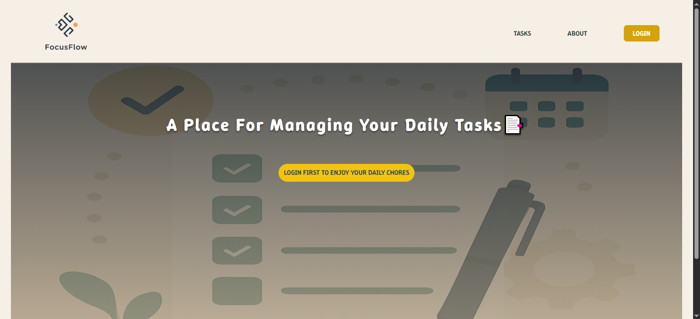
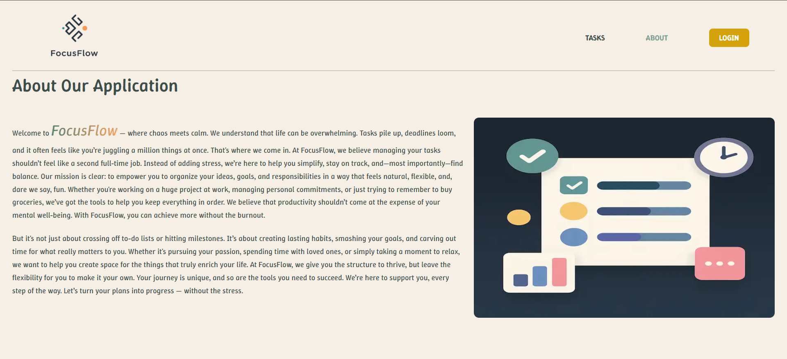
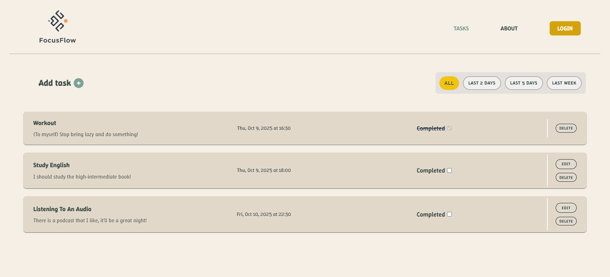

# FocusFlow

[](https://github.com/Ramtin26/The-focus-flow)

A small productivity app built with **React** and **Redux Toolkit** to help users manage their daily routines and tasks efficiently.

---

## 🚀 Features

- Add, edit, and delete daily tasks
- Simple user authentication (stored locally)
- Persistent data via **localStorage**
- Modular styling using **CSS Modules**
- Built with **Vite** for fast development and optimized build

---

## 🧠 Tech Stack

- **React 19**
- **Redux Toolkit**
- **React Router DOM**
- **CSS Modules**
- **Vite**

---

## ⚙️ How It Works

All user and task data is stored locally in the browser’s `localStorage`.  
This means no external database or authentication API is required.

---

## 🖼️ Preview

### Home Page



### Login Page


### About Page



### Tasks Page



---

## 💻 Run Locally

```bash
# Clone the repository
git clone https://github.com/yourusername/focusflow.git

# Navigate to the project directory
cd focusflow

# Install dependencies
npm install

# Run the app
npm run dev
```
